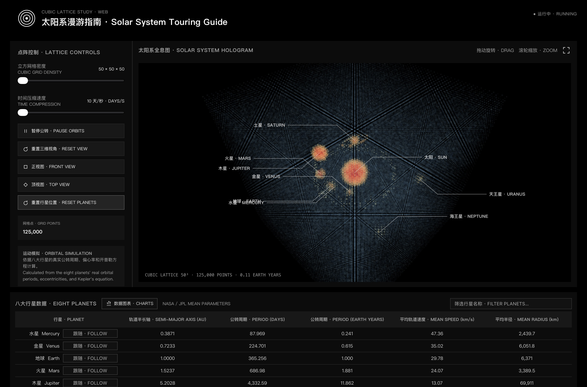
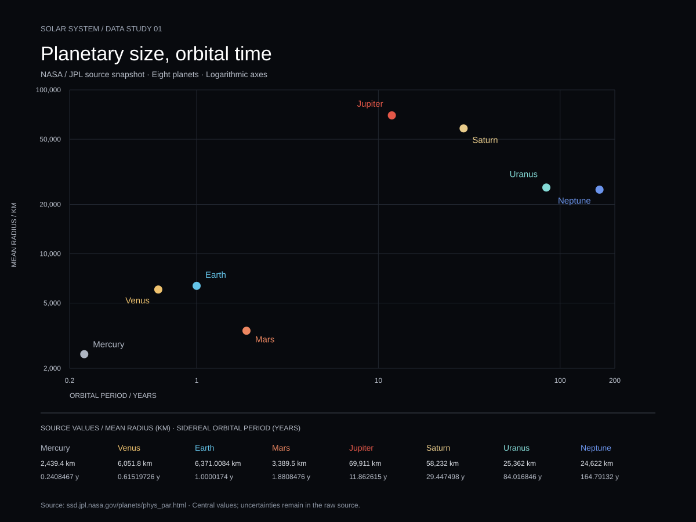

# Solar System

[在线打开 / GitHub Pages](https://fengziqian0206.github.io/Solar-System/)

基于 Three.js 的立方点阵太阳系全息图，复刻桌面版“太阳系漫游指南”的视觉与交互。

直接访问 GitHub Pages 即可运行，无需安装。

## 现象 / Phenomenon

项目以太阳系为主题，用彩色半透明粒子呈现太阳、八大行星、小行星带与土星环，并通过公转与行星数据比较展示它们在时间尺度和物理属性上的差异。网页沿用公转周期、偏心率与开普勒方程计算运动；显示用的星球大小、距离和时间压缩经过艺术化处理，不是等比例天文星历。

黑白双语界面与彩色点云形成对比，支持三档密度、旋转缩放、视图切换、全屏、行星跟随及整合的数据图表。原有网页文件和最终呈现不因这次仓库整理而改变。

## 作品图 / Picture



`out/main.jpg` 是作者提供的作品图，按原文件保留。它展示原有网页效果，不是下方 Python 绘图脚本的输出。

## 来源 / Sources

- 最初参考：[ECharts GL](https://github.com/ecomfe/echarts-gl) 三维散点示例（用户提供的 simplex-noise 示例代码）。
- 三维网页实现：[Three.js](https://threejs.org/)。
- 本次可复现数据流程的原始来源：[NASA/JPL — Planetary Physical Parameters](https://ssd.jpl.nasa.gov/planets/phys_par.html)。原始响应内容保存到 `data/jpl-planetary-physical-parameters.html`，未经删改；下载地址、时间、字节数和 SHA-256 保存在 `data/source.json`。

新增 Python 图使用 JPL 表中的 **Mean Radius（km）** 和 **Sidereal Orbital Period（y）**，取八颗行星的中心值，使用双对数坐标；误差值及参考文献保留在原始文件中。矮行星表不属于这张图的范围。

网页继续使用 `app.js` 中已有的行星参数，未被本次下载的数据覆盖。新快照与原网页的数据版本、精度可能不同；新增图是独立的数据说明，不替代网页已有图表。

## 如何运行 / How to run

### 原有互动网页

直接访问上面的 GitHub Pages 链接。需要本地运行时，在仓库根目录使用 Python 3：

```sh
python -m http.server 8000
```

然后打开 `http://localhost:8000/`。不要直接双击 `index.html`，浏览器对本地模块加载有限制。

### 原始数据 → 图片

需要 Python 3.9 或更高版本，无额外第三方依赖。在仓库根目录运行：

```sh
python fetch.py
python plot.py
python plot.py --check
```

1. `fetch.py` 仅在原始文件不存在时联网下载；已有快照会直接复用，不覆盖。
2. `plot.py` 离线读取 `data/`，验证文件校验值、表头、单位与八颗行星是否齐全，然后生成 `out/planetary-data.svg`。不会改动 `out/main.jpg` 或任何网页文件。
3. `--check` 运行小型校验，包括非法数据不能被静默接受。

仓库已包含原始数据，克隆后可直接离线运行 `python plot.py`。Windows 若使用 Python Launcher，可将 `python` 替换为 `py`。



## 仓库结构 / Repository layout

```text
Solar-System/
├── README.md
├── PROCESS.md                 AI 协作、保留与拒绝的内容
├── fetch.py                   下载一次，原样保存
├── plot.py                    读取 data/，生成独立 SVG
├── data/
│   ├── jpl-planetary-physical-parameters.html
│   └── source.json            来源、下载时间与文件校验值
├── out/
│   ├── main.jpg               作者提供的最终作品图
│   └── planetary-data.svg     Python 生成的数据图
├── index.html                 以下原有网页内容保留原路径
├── app.js
├── style.css
├── startup.js
├── renderer-support.js
├── planet-charts.js
├── test-planet-charts.cjs
└── vendor/
```

为保持 GitHub Pages、模块导入和资源路径不变，本次不把原有网页搬到子目录，也不删除原有内容。
